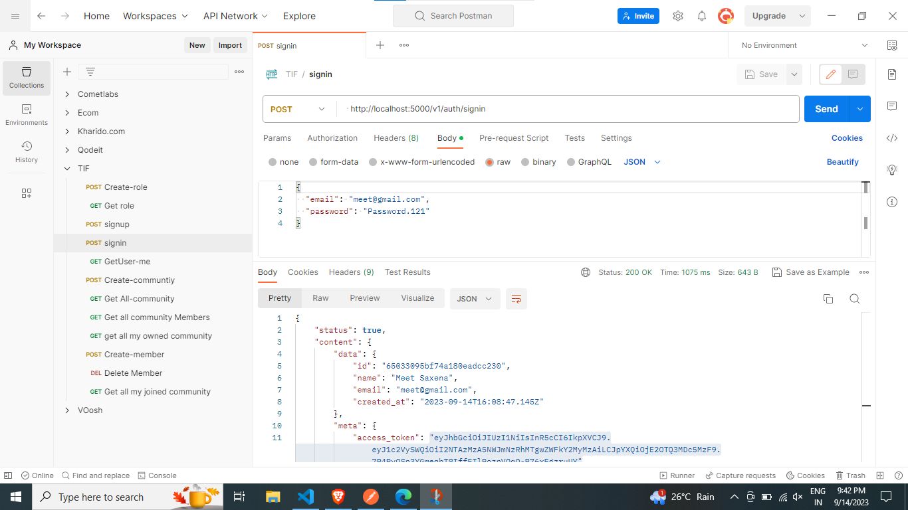
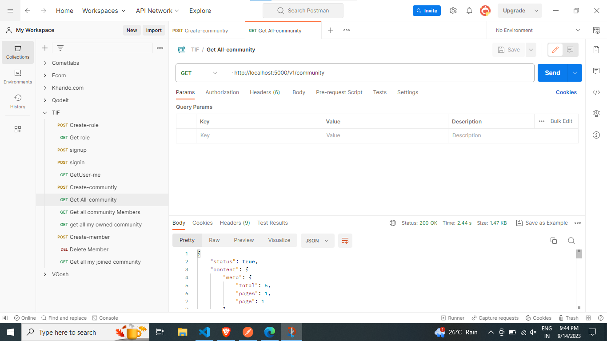
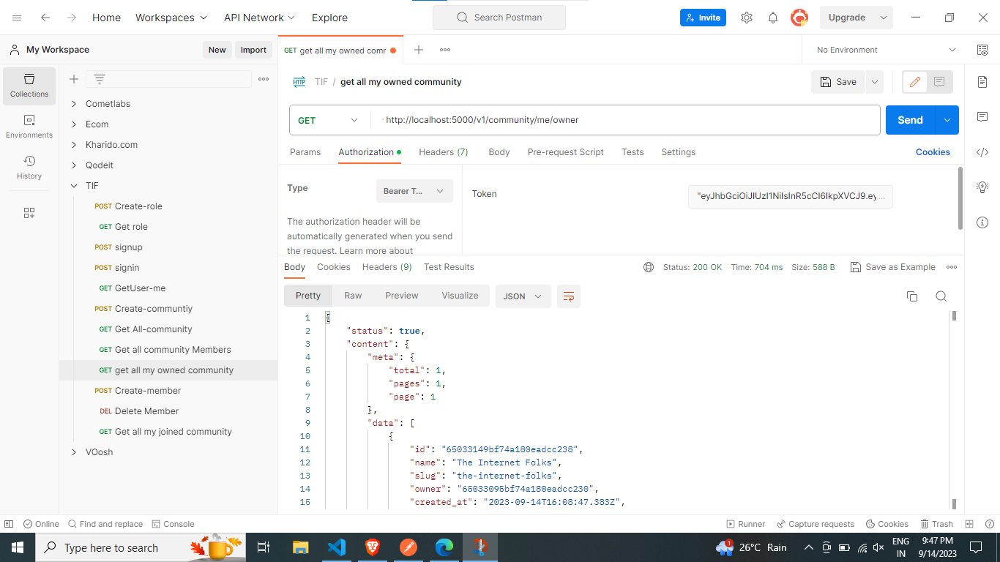
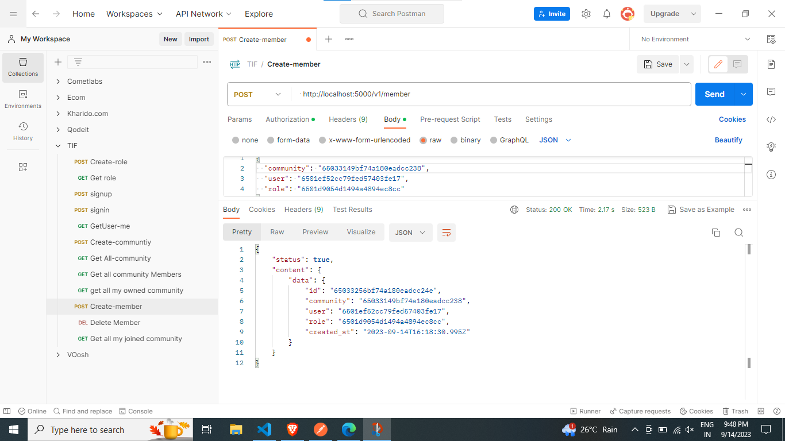

# The Internet Folks: SDE Intern Assignment [002]

About

You run a SaaS Platform that enables user to make their communities and add members to it.

Each user, can create a community and (automatically) gets assigned the Community Admin role. They can add other users to the community who get assigned the Community Member role.

## User Stories (Features)

## Module: Authentication

#### Feature: User should be able to signup using valid name, email and strong password.

#### Feature: User should be able to signin using valid credentials.

## Module: Community

#### Feature: User should be able to see all communities.

#### Feature: User should be able to create a community.

## Module: Moderation

#### Feature: User should be able to see all community members.

#### Feature: User should be able to add a user as member.

#### Feature: User should be able to remove a member from community.

## Tech Stack

#### Language: Node v14+, Expressjs

#### Database: MongoDB

#### ORM: Mongoose

## Routes

### Role

#### Create - POST /v1/role

#### Get All - GET /v1/role

### User

#### Sign Up - POST /v1/auth/signup

#### Sign in - POST /v1/auth/signin

#### Get Me - GET /v1/auth/me

### Community

#### Create - POST /v1/community

#### Get All - GET /v1/community

#### Get All Members -GET /v1/community/:id/members

#### Get My Owned Community - GET /v1/community/me/owner

#### Get My Joined Community - GET /v1/community/me/member

## Member

#### Add Member - POST /v1/member

#### Remove Member - DELETE /v1/member/:id

# Outputs:

